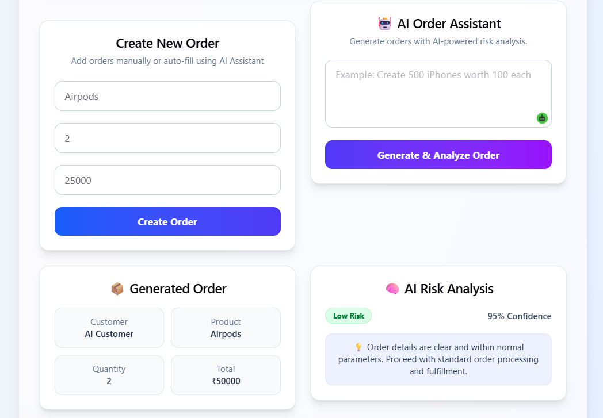
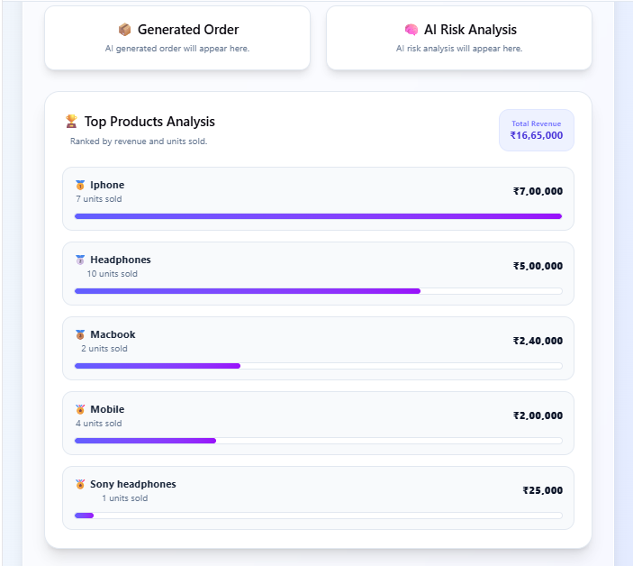

# Smart OrderFlow

Smart OrderFlow is a full-stack order management application built with Spring Boot and React. It helps users manage orders efficiently while using Google Gemini AI to generate orders from natural language prompts and provide basic risk analysis.

The project also demonstrates secure authentication, event-driven communication, caching, and containerized deployment using modern backend technologies.

## Features

- Secure JWT Authentication
- AI-powered Order Generation (Google Gemini)
- AI Risk Analysis
- Create, View and Delete Orders
- Revenue Dashboard & Top Products Analytics
- Kafka-based Event Processing
- Redis Caching
- Docker Support
- REST APIs with Swagger Documentation

## Tech Stack

**Backend**
- Java
- Spring Boot
- Spring Security
- Spring Data JPA
- Hibernate
- MySQL
- Kafka
- Redis

**Frontend**
- React
- Vite
- Tailwind CSS

**AI**
- Google Gemini API
- Prompt Engineering

**DevOps**
- Docker
- Docker Compose

## Architecture

```text
React Frontend
       │
       ▼
Spring Boot REST API
       │
 ┌─────┼──────────────┐
 ▼     ▼              ▼
MySQL Redis         Kafka
       │
       ▼
 Google Gemini AI
```

## Getting Started

### Backend

```bash
mvnw.cmd spring-boot:run
```

### Frontend

```bash
cd frontend
npm install
npm run dev
```

### Docker

```bash
docker compose up --build
```

## Screenshots

### Login


### Dashboard


### AI Order Generation


### Analytics


## Author

**Bhargavi Goyal**
